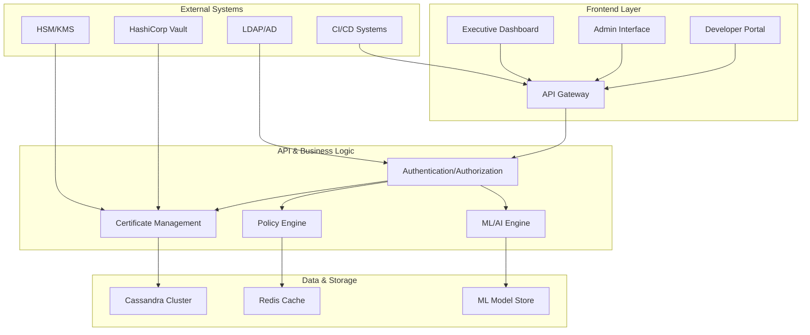

# Cassandra Security Manager

[](https://opensource.org/licenses/Apache-2.0)
[](https://www.python.org/downloads/)
[](https://cassandra.apache.org/)
[]()

An enterprise-grade, AI-powered certificate management platform for Apache Cassandra with quantum-resistant cryptography, multi-tenancy, and autonomous operations.

## 🌟 Overview

Cassandra Security Manager revolutionizes certificate management for Apache Cassandra and beyond through:

- **🔮 Quantum-Resistant Security**: Future-proof cryptography with post-quantum algorithms (Dilithium, Kyber, SPHINCS+)
- **🚀 AI-Powered Operations**: Machine learning for predictive analytics and self-healing infrastructure
- **🌍 Global Enterprise Scale**: Multi-tenant, multi-region deployment with 99.99% availability
- **🔧 Zero-Touch Automation**: 95% automated operations with intelligent decision making
- **🔒 Hardware Security**: FIPS 140-2 Level 3 HSM integration and HashiCorp Vault support
- **📊 Executive Intelligence**: Real-time dashboards and business metrics for strategic decision making

## 🏆 Enterprise Features

### Core Capabilities
- 🔐 **Hierarchical PKI**: Multi-tier certificate authority with quantum-resistant algorithms
- 🚀 **Automated Lifecycle**: Generation, deployment, renewal, and revocation workflows
- 📦 **Secure Connection Bundles**: Automated SCB generation and distribution
- 🔍 **Intelligent Discovery**: Network scanning and certificate inventory management
- 📈 **Predictive Analytics**: ML-powered failure prediction and prevention
- 🌐 **Multi-Region HA**: Active-active deployment with < 30 second failover

### Advanced Security
- 🔒 **Zero-Trust Architecture**: Verify everything, trust nothing
- 🛡️ **Hardware Security Modules**: FIPS 140-2 Level 3 compliance
- 🔐 **Vault Integration**: Centralized secret management
- 🕵️ **Anomaly Detection**: AI-powered threat identification
- 📋 **Compliance Automation**: Multi-framework regulatory support
- 🔍 **Immutable Audit**: Cryptographically signed audit trails

### Enterprise Operations
- 🏢 **Multi-Tenancy**: Complete tenant isolation with 10,000+ tenant support
- 🌍 **Geographic Distribution**: 20+ region deployment with data sovereignty
- 📊 **Executive Dashboards**: Real-time KPIs and business intelligence
- 🤖 **Self-Healing**: Autonomous issue detection and remediation
- 🔄 **CI/CD Native**: 15+ platform integrations
- 📱 **Mobile Ready**: Responsive design for mobile management

## 🚀 Quick Start

### Prerequisites

- Python 3.11+
- Docker (for Cassandra during development/testing)
- Git

### Installation

```bash
# Clone the repository
git clone https://github.com/axonops/cassandra-security-manager.git
cd cassandra-security-manager

# Create virtual environment
python3.11 -m venv venv
source venv/bin/activate  # On Windows: venv\Scripts\activate

# Install dependencies
pip install -r requirements.txt
pip install -r requirements-dev.txt

# Run comprehensive tests
pytest --cov=. --cov-report=html --cov-fail-under=90

# Start the application
python -m api.main
```

### Docker Deployment

```bash
# Build the container
docker build -t cassandra-security-manager .

# Run with bundled Cassandra
docker run -d \
  -p 8080:8080 \
  -v csm-data:/data \
  cassandra-security-manager

# Or use Docker Compose for full stack
docker-compose up -d
```

### Kubernetes Deployment

```bash
# Apply Kubernetes manifests
kubectl apply -f k8s/

# Or use Helm chart
helm install csm ./charts/cassandra-security-manager
```

## 📚 Documentation

### Getting Started
- [📋 Requirements Overview](docs/requirements/README.md)
- 🚀 Quick Start Guide *(coming soon)*
- 🔧 Installation Guide *(coming soon)*
- ⚙️ Configuration Reference *(coming soon)*

### Architecture & Design
- 🏗️ Architecture Overview *(coming soon)*
- 🔐 Security Architecture *(coming soon)*
- 🌍 Multi-Region Deployment *(coming soon)*
- 🤖 AI/ML Pipeline *(coming soon)*

### Operations
- 📊 Monitoring & Alerting *(coming soon)*
- 🔄 Backup & Recovery *(coming soon)*
- 🔧 Troubleshooting *(coming soon)*
- 📈 Performance Tuning *(coming soon)*

### API & Integrations
- [🔌 API Documentation](http://localhost:8080/docs) (when running)
- 🔗 Integration Guides *(coming soon)*
- 🛠️ SDK Documentation *(coming soon)*
- 📦 CLI Reference *(coming soon)*

## 🏗️ Architecture



## 🎯 Key Metrics & Performance

### Availability & Performance
- **Availability**: 99.99% (52.56 minutes downtime/year)
- **API Response**: < 100ms (p95)
- **Failover Time**: < 30 seconds
- **Certificate Generation**: < 2 seconds (RSA-4096)
- **Global Sync**: < 5 minutes cross-region

### Scalability
- **Tenants**: 10,000+ concurrent tenants
- **Regions**: 20+ geographic regions
- **Throughput**: 100,000+ operations/second
- **Storage**: Petabyte-scale certificate data
- **Users**: Unlimited concurrent users

### Security & Compliance
- **Encryption**: AES-256-GCM, quantum-resistant algorithms
- **Key Security**: FIPS 140-2 Level 3 HSM support
- **Audit**: 100% operation coverage
- **Compliance**: PCI-DSS, SOX, GDPR, HIPAA ready
- **Zero Breaches**: Security-first architecture

## 🛠️ Development

### Code Quality Standards
- **Test Coverage**: 90% minimum
- **No Placeholders**: Production-ready code only
- **Real Systems**: No mocks in integration tests
- **Continuous Testing**: Ephemeral Cassandra containers
- **Security First**: Built-in security controls

### Development Workflow
```bash
# Setup development environment
make dev-setup

# Run tests with real Cassandra
make test-integration

# Run security scans
make security-scan

# Generate documentation
make docs

# Build containers
make build
```

## 🤝 Contributing

We welcome contributions! Please see our [Contributing Guide](CONTRIBUTING.md) for details on:

- 📝 Code standards and testing requirements
- 🔄 Development workflow and Git practices
- 🚀 Submitting pull requests
- 🐛 Reporting issues and feature requests
- 🎯 Roadmap and project priorities

### Community Guidelines
- Follow our [Code of Conduct](CODE_OF_CONDUCT.md)
- Use our issue templates for bug reports and features
- Join discussions on [GitHub Discussions](https://github.com/axonops/cassandra-security-manager/discussions)
- Connect with us on [Discord](https://discord.gg/cassandra-security-manager)

## 🔒 Security

This project takes security seriously. For security vulnerabilities:

**🚨 Report to**: cassandra-security-manager-security@googlegroups.com

**⚠️ Do NOT** create public issues for security vulnerabilities.

### Security Features
- 🔐 Quantum-resistant cryptography
- 🛡️ Hardware security module support
- 🕵️ Real-time threat detection
- 📋 Automated compliance validation
- 🔍 Immutable audit trails

## 📄 License

This project is licensed under the Apache License 2.0 - see the [LICENSE](LICENSE) file for details.

**Why Apache 2.0?** 
We chose the same license as Apache Cassandra to encourage community contributions and ensure compatibility with the broader Cassandra ecosystem.

## 🏢 Acknowledgments

Cassandra Security Manager is an open source project by [AxonOps](https://axonops.com), designed to address the complex security needs of enterprise Apache Cassandra deployments.

### Built With
- **FastAPI** - Modern Python web framework
- **Apache Cassandra** - Distributed database
- **TensorFlow/PyTorch** - Machine learning
- **Kubernetes** - Container orchestration
- **HashiCorp Vault** - Secret management

## 🆘 Support

### Getting Help
- **📖 Documentation**: Complete guides in `/docs`
- **🐛 Issues**: [GitHub Issues](https://github.com/axonops/cassandra-security-manager/issues)
- **💬 Discussions**: [GitHub Discussions](https://github.com/axonops/cassandra-security-manager/discussions)
- **💭 Discord**: [Community Chat](https://discord.gg/cassandra-security-manager)
- **📧 Enterprise**: enterprise@axonops.com

### Resources
- **🎓 Tutorials**: Step-by-step guides
- **📺 Videos**: YouTube channel
- **📝 Blog**: Technical articles and best practices
- **🎪 Events**: Webinars and conferences

---

**🚀 Ready to revolutionize your certificate management? Get started with Cassandra Security Manager today!**