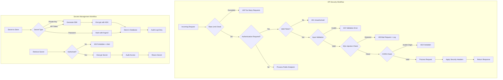

# Phase 0 Epic 04: Security Fundamentals

## Overview
Core security features that protect both the application and its data must be established before any certificate operations begin. This epic implements the fundamental security controls that ensure the system itself cannot be compromised, as a compromised certificate management system would undermine all security guarantees.

## User Stories
1. **A4.1 - API Security Hardening**: Implement comprehensive API security against common attacks
2. **A4.2 - Secrets Management Foundation**: Establish secure storage for sensitive cryptographic materials

## Dependencies
- A1 (API Framework) - Security middleware requires API framework
- A2 (Authentication) - Security controls build on auth infrastructure
- A3 (Data Persistence) - Secrets storage requires database

## Success Metrics
- Zero security vulnerabilities in OWASP Top 10 categories
- All inputs validated against strict schemas
- 100% of secrets encrypted at rest
- Rate limiting preventing brute force attacks
- Security scan passing with no critical/high findings

## Technical Considerations
- Use OWASP security headers
- Implement Content Security Policy
- Use parameterized queries exclusively
- Implement security event monitoring
- Plan for future HSM integration
- Consider implementing WAF rules

## Workflow Diagram

