# Phase 1 Epic 06: Certificate Authority Hierarchy

## Overview
Establishing a proper CA hierarchy forms the basis of all certificate operations. This epic implements the foundational certificate authority structure with strict security controls, including air-gapped root CA operations and proper certificate chain management.

## User Stories
1. **1.1 - Root CA Initialisation**: Establish a root Certificate Authority with quantum-resistant algorithms
2. **1.2 - Subordinate CA Generation**: Create subordinate CAs for operational certificate signing

## Dependencies
- A1 (API Framework) - CA operations exposed via API
- A2 (Authentication) - CA operations require authorisation
- A3 (Data Persistence) - CA certificates and keys stored securely
- A4 (Security) - Private keys protected by secrets management
- A5 (Operations) - CA operations monitored and logged

## Success Metrics
- Root CA successfully initialised with quantum-resistant algorithms
- Subordinate CAs properly chained to root
- Zero private key exposure incidents
- 100% of CA operations audit logged
- Certificate chains validate correctly

## Technical Considerations
- Implement air-gap workflow for root CA
- Use HSM for root CA key storage when available
- Support both RSA and ECC algorithms
- Plan for post-quantum algorithm migration
- Implement proper certificate extensions
- Consider cross-signing for migration

## Workflow Diagram

```mermaid
graph TB
    subgraph "Root CA Initialisation"
        A[Initialise Root CA Request] --> B{First Time?}
        B -->|Yes| C[Generate Root Key Pair]
        B -->|No| D[Error: Root Already Exists]
        
        C --> E{HSM Available?}
        E -->|Yes| F[Generate in HSM]
        E -->|No| G[Generate in Software]
        
        F --> H[Create Self-Signed Cert]
        G --> H
        
        H --> I[Set Extensions]
        I --> J[Store Encrypted]
        J --> K[Backup Key Shares]
        K --> L[Audit Log]
        L --> M[Return Certificate]
    end
    
    subgraph "Subordinate CA Creation"
        N[Create Sub-CA Request] --> O{Root CA Available?}
        O -->|No| P[Error: No Root CA]
        O -->|Yes| Q{Authorised?}
        Q -->|No| R[403 Forbidden]
        Q -->|Yes| S[Generate Sub-CA Key Pair]
        
        S --> T[Create CSR]
        T --> U{Root CA Online?}
        U -->|Yes| V[Sign with Root CA]
        U -->|No| W[Queue for Offline Signing]
        
        V --> X[Set Path Length]
        X --> Y[Add Constraints]
        Y --> Z[Store Certificate]
        Z --> AA[Update Chain]
        AA --> AB[Audit Log]
        AB --> AC[Return Certificate]
    end
    
    subgraph "Certificate Chain Management"
        AD[Certificate Request] --> AE[Identify Signing CA]
        AE --> AF{CA Authorised?}
        AF -->|No| AG[Select Different CA]
        AF -->|Yes| AH[Sign Certificate]
        AH --> AI[Build Chain]
        AI --> AJ[Validate Chain]
        AJ --> AK{Valid?}
        AK -->|No| AL[Error: Invalid Chain]
        AK -->|Yes| AM[Store with Chain]
    end
```

