# Phase 1 Epic 07: Secure Certificate Generation

## Overview
Certificate generation with strong cryptographic standards and policy enforcement forms the core functionality of the system. This epic implements secure certificate generation with quantum-resistant algorithms, comprehensive policy enforcement, and proper integration with Cassandra's security requirements.

## User Stories
1. **2.1 - Quantum-Resistant Certificate Generation**: Generate certificates using post-quantum algorithms
2. **2.2 - Certificate Policy Enforcement**: Enforce Organisational policies during certificate generation

## Dependencies
- Epic 1 (CA Hierarchy) - Requires CAs for signing certificates
- A1 (API Framework) - Certificate operations via API
- A2 (Authentication) - Certificate generation requires authorisation  
- A3 (Data Persistence) - Certificates stored securely
- A4 (Security) - Private keys protected

## Success Metrics
- 100% of certificates use approved algorithms
- Zero weak certificates generated
- All certificates comply with policies
- Post-quantum algorithms successfully implemented
- Certificate generation < 2 seconds

## Technical Considerations
- Support multiple algorithm types (RSA, ECDSA, Post-Quantum)
- Implement certificate templates for common use cases
- Ensure Cassandra compatibility
- Plan for algorithm agility
- Support hardware acceleration
- Consider batch generation needs

## Workflow Diagram

```mermaid
graph TB
    subgraph "Certificate Generation Flow"
        A[Certificate Request] --> B{Validate Request}
        B -->|Invalid| C[400 Bad Request]
        B -->|Valid| D{Check Authorisation}
        D -->|Unauthorised| E[403 Forbidden]
        D -->|Authorised| F{Check Rate Limit}
        F -->|Exceeded| G[429 Too Many Requests]
        F -->|OK| H[Select Algorithm]
        
        H --> I{Algorithm Type}
        I -->|Classical| J[Generate RSA/ECDSA]
        I -->|Post-Quantum| K[Generate PQ Keys]
        I -->|Hybrid| L[Generate Both]
        
        J --> M[Apply Policy]
        K --> M
        L --> M
        
        M --> N{Policy Check}
        N -->|Fail| O[Policy Violation Error]
        N -->|Pass| P[Create CSR]
        
        P --> Q[Select Signing CA]
        Q --> R[Sign Certificate]
        R --> S[Add Extensions]
        S --> T[Store Certificate]
        T --> U[Audit Log]
        U --> V[Return Certificate]
    end
    
    subgraph "Policy Enforcement"
        W[Policy Engine] --> X{Check Key Strength}
        X --> Y{Check Validity Period}
        Y --> Z{Check Extensions}
        Z --> AA{Check SAN/CN}
        AA --> AB{Check Algorithm}
        AB --> AC[Policy Decision]
    end
    
    subgraph "Cassandra Integration"
        AD[Cassandra Node] --> AE[Request Node Cert]
        AE --> AF{Verify Node Identity}
        AF --> AG[Generate with Node Extensions]
        AG --> AH[Include Cluster Info]
        AH --> AI[Set Cassandra-Specific OIDs]
    end
```

