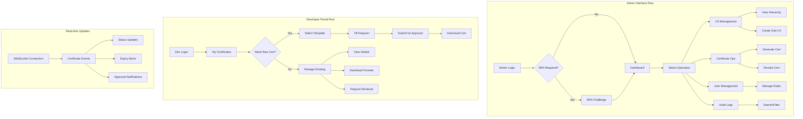

# Phase 1 Epic 08: Basic User Interface

## Overview
While maintaining API-first architecture, a user interface provides accessibility for non-developer users. This epic implements both an administrative web interface for system management and a developer portal for self-service certificate operations.

## User Stories
1. **3.1 - Administrative Web Interface**: Web-based interface for certificate management operations
2. **3.2 - Developer Portal**: Self-service portal for application developers

## Dependencies
- A1 (API Framework) - UI consumes REST APIs
- A2 (Authentication) - UI requires authentication
- Epic 1 (CA Hierarchy) - Display CA structure
- Epic 2 (Certificates) - Certificate operations

## Success Metrics
- UI response time < 500ms
- All API functions accessible via UI
- Mobile-responsive design
- Accessibility WCAG 2.1 AA compliant
- 90% user task completion rate

## Technical Considerations
- React-based single-page application
- Server-side rendering for performance
- Progressive enhancement
- Real-time updates via WebSocket
- Internationalization support
- Dark mode support

## Workflow Diagram

