# Phase 1 Epic 09: Certificate Storage and Retrieval

## Overview
Secure storage and efficient retrieval of certificates and private keys is fundamental to certificate lifecycle management. This epic implements encrypted storage, multiple export formats, and high-performance search capabilities while maintaining the highest security standards.

## User Stories
1. **4.1 - Secure Certificate Storage**: Encrypted storage of certificates and private keys
2. **4.2 - Certificate Format Support**: Multiple export formats and compatibility layers

## Dependencies
- A3 (Data Persistence) - Uses Cassandra for storage
- A4 (Security Fundamentals) - Encryption and key management
- Epic 1 (CA Hierarchy) - Certificate chain storage
- Epic 2 (Certificates) - Generated certificates to store

## Success Metrics
- Certificate storage latency < 50ms
- Retrieval performance < 100ms for single certificate
- 100% encryption at rest for private keys
- Support for 5+ export formats
- Zero private key exposure in logs/APIs
- 99.99% storage availability

## Technical Considerations
- AES-256-GCM encryption for private keys
- Separate key encryption keys (KEK) and data encryption keys (DEK)
- Hardware Security Module (HSM) integration ready
- Certificate indexing for fast search
- Chunked storage for large certificates
- Distributed storage across Cassandra nodes
- Backup and recovery procedures
- Audit trail for all storage operations

## Workflow Diagram

```mermaid
graph TB
    subgraph "Certificate Storage Flow"
        A[Certificate Generated] --> B{Private Key?}
        B -->|Yes| C[Encrypt Private Key]
        B -->|No| D[Store Public Certificate]
        C --> E[Store Encrypted Key]
        E --> F[Store Key Metadata]
        D --> G[Store Certificate Metadata]
        F --> H[Update Index]
        G --> H
        H --> I[Audit Log Entry]
    end
    
    subgraph "Certificate Retrieval Flow"
        J[Retrieval Request] --> K{Format Specified?}
        K -->|Yes| L[Load Certificate]
        K -->|No| M[Default Format]
        L --> N{Private Key Needed?}
        M --> N
        N -->|Yes| O[Decrypt Private Key]
        N -->|No| P[Format Certificate]
        O --> Q[Combine Key + Cert]
        Q --> R[Export in Format]
        P --> R
        R --> S[Return to User]
    end
    
    subgraph "Search and Discovery"
        T[Search Query] --> U[Parse Search Terms]
        U --> V[Query Index]
        V --> W[Apply Filters]
        W --> X[Rank Results]
        X --> Y[Return Results]
    end
    
    subgraph "Backup and Recovery"
        Z[Backup Schedule] --> AA[Export Certificates]
        AA --> BB[Encrypt Backup]
        BB --> CC[Store Offsite]
        DD[Recovery Request] --> EE[Verify Authorisation]
        EE --> FF[Decrypt Backup]
        FF --> GG[Restore Certificates]
    end
```

