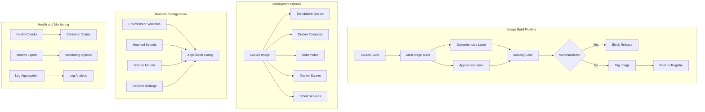

# Phase 1 Epic 10: Container Distribution

## Overview
Modern deployments rely heavily on containerization. This epic provides production-ready Docker images, deployment orchestration, and secure distribution mechanisms for the Cassandra Security Manager, enabling easy adoption and scaling across diverse environments.

## User Stories
1. **5.1 - Docker Image Creation**: Production-ready Docker images with security scanning

## Dependencies
- A1 (API Framework) - Application to containerize
- A3 (Data Persistence) - Database connectivity
- A4 (Security Fundamentals) - Security hardening
- A5 (Operational Foundation) - Health checks and metrics

## Success Metrics
- Image build time < 5 minutes
- Image size < 500MB
- Security scan score > 95/100
- Container startup time < 30 seconds
- Zero critical vulnerabilities
- 99.9% container availability

## Technical Considerations
- Multi-stage Docker builds for size optimization
- Distroless base images for security
- Non-root user execution
- Health check integration
- Configuration via environment variables
- Secret management integration
- Resource constraints and limits
- Security scanning automation
- Multi-architecture support (amd64, arm64)

## Workflow Diagram

