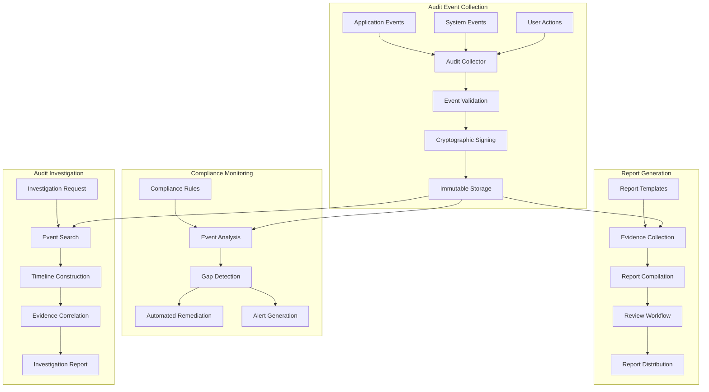

# Phase 2 Epic 11: Audit and Compliance Reporting

## Overview
Comprehensive audit trails and compliance reporting are essential for regulatory adherence and security governance. This epic implements immutable audit logging, automated compliance reporting, and evidence collection capabilities to support regulatory requirements and security assessments.

## User Stories
1. **11.1 - Detailed Audit Trail**: Comprehensive, immutable audit logging with forensic capabilities
2. **11.2 - Compliance Report Generation**: Automated compliance reporting for multiple regulatory frameworks

## Dependencies
- A4 (Security Fundamentals) - Security logging infrastructure
- A5 (Operational Foundation) - Base monitoring and logging
- All operational epics (6-9) - Activities to audit and report on

## Success Metrics
- 100% audit trail completeness
- Zero audit log tampering incidents
- < 24 hours compliance report generation
- 100% regulatory requirement coverage
- < 1% audit finding rate
- Automated evidence collection for 95% of requirements

## Technical Considerations
- Immutable audit log storage with cryptographic integrity
- SIEM integration for security monitoring
- Automated compliance framework mapping
- Evidence collection and correlation
- Long-term retention with compression
- Real-time audit event processing
- Cross-system audit trail correlation
- Compliance gap detection and alerting

## Workflow Diagram

