# Phase 2 Epic 06: Secure Connection Bundle Management

## Overview
Cassandra Secure Connection Bundles (SCBs) simplify client connectivity by packaging certificates, configuration, and connection metadata. This epic implements automated SCB generation, secure distribution, and lifecycle management to streamline client application deployment and reduce configuration complexity.

## User Stories
1. **06.1 - SCB Generation and Distribution**: Automated generation and secure distribution of connection bundles
2. **06.2 - Bundle Lifecycle Management**: Versioning, updates, and lifecycle management for connection bundles

## Dependencies
- Epic 1 (CA Hierarchy) - Certificate chains for bundles
- Epic 2 (Certificates) - Client certificates for authentication
- Epic 4 (Storage) - Bundle storage and retrieval
- A4 (Security) - Secure distribution mechanisms

## Success Metrics
- SCB generation time < 30 seconds
- Bundle size < 5MB (compressed)
- 100% configuration accuracy
- Zero credential exposure during distribution
- 99.9% bundle availability
- Support for 10+ client platforms

## Technical Considerations
- ZIP-based bundle format with standardized structure
- Embedded certificates and configuration files
- Platform-specific client configurations
- Secure distribution channels (HTTPS, signed bundles)
- Version management and compatibility tracking
- Automatic bundle updates and notifications
- Integration with CI/CD pipelines
- Support for multiple Cassandra clusters

## Workflow Diagram

```mermaid
graph TB
    subgraph "SCB Generation Flow"
        A[Client Request] --> B[Authenticate User]
        B --> C[Select Cluster Config]
        C --> D[Generate Client Certificate]
        D --> E[Package Configuration]
        E --> F[Create Bundle ZIP]
        F --> G[Sign Bundle]
        G --> H[Store Bundle]
        H --> I[Provide Download Link]
    end
    
    subgraph "Bundle Contents"
        J[SCB Bundle] --> K[Client Certificate]
        J --> L[CA Certificate Chain]
        J --> M[Cluster Configuration]
        J --> N[Connection Metadata]
        J --> O[Driver-Specific Config]
        J --> P[README and Examples]
    end
    
    subgraph "Distribution Channels"
        Q[Generated Bundle] --> R[Direct Download]
        Q --> S[API Distribution]
        Q --> T[CI/CD Integration]
        Q --> U[Package Repositories]
        Q --> V[Cloud Storage]
    end
    
    subgraph "Bundle Lifecycle"
        W[Bundle Creation] --> X[Active Use]
        X --> Y{Update Available?}
        Y -->|Yes| Z[Generate New Version]
        Y -->|No| AA[Continue Monitoring]
        Z --> AB[Notify Users]
        AB --> AC[Deprecate Old Version]
        AC --> AD[Archive Expired]
    end
```

