# Phase 2 Epic 07: Automated Certificate Deployment

## Overview
Manual certificate deployment is error-prone and time-consuming. This epic implements automated, secure deployment of certificates to Cassandra nodes and client applications, including verification, rollback capabilities, and zero-downtime updates.

## User Stories
1. **07.1 - Push-Based Certificate Deployment**: Automated deployment to target systems
2. **07.2 - Deployment Verification and Rollback**: Validation and recovery mechanisms

## Dependencies
- Epic 1 (CA Hierarchy) - Certificates to deploy
- Epic 2 (Certificates) - Generated certificates for deployment
- Epic 4 (Storage) - Certificate retrieval for deployment
- A4 (Security) - Secure deployment channels

## Success Metrics
- Deployment success rate > 99.5%
- Zero-downtime deployment capability
- Deployment time < 5 minutes per node
- 100% verification before activation
- Rollback time < 2 minutes
- Support for 50+ concurrent deployments

## Technical Considerations
- SSH/SCP for secure file transfer
- Ansible/Salt for orchestration
- Agent-based and agentless deployment
- Rolling deployment strategies
- Health checks and verification
- Automatic rollback triggers
- Integration with configuration management
- Support for containerized environments

## Workflow Diagram

```mermaid
graph TB
    subgraph "Deployment Planning"
        A[Certificate Update] --> B[Target Selection]
        B --> C[Deployment Strategy]
        C --> D[Pre-deployment Validation]
        D --> E[Schedule Deployment]
    end
    
    subgraph "Deployment Execution"
        F[Start Deployment] --> G[Backup Current Certs]
        G --> H[Transfer New Certs]
        H --> I[Update Configuration]
        I --> J[Restart Services]
        J --> K[Verify Connectivity]
    end
    
    subgraph "Verification & Rollback"
        L[Post-deployment Check] --> M{Health OK?}
        M -->|Yes| N[Mark Success]
        M -->|No| O[Initiate Rollback]
        O --> P[Restore Backup]
        P --> Q[Restart Services]
        Q --> R[Verify Rollback]
    end
    
    subgraph "Monitoring"
        S[Deployment Monitor] --> T[Health Checks]
        T --> U[Performance Metrics]
        U --> V[Security Validation]
        V --> W[Compliance Verification]
    end
```

