# Phase 2 Epic 08: Certificate Lifecycle Management

## Overview
Proactive certificate lifecycle management prevents service disruptions and security incidents. This epic implements comprehensive monitoring, alerting, and automated renewal capabilities to ensure certificates remain valid and secure throughout their lifecycle.

## User Stories
1. **08.1 - Expiration Monitoring and Alerting**: Proactive monitoring and multi-channel alerting for certificate expiration
2. **08.2 - Automated Certificate Renewal**: Intelligent automated renewal with policy-based decision making

## Dependencies
- Epic 1 (CA Hierarchy) - Certificate authorities for renewal
- Epic 2 (Certificates) - Certificate generation for renewals
- Epic 4 (Storage) - Certificate storage and retrieval
- Epic 7 (Deployment) - Automated deployment of renewed certificates

## Success Metrics
- Zero certificate-related service outages
- 99.9% successful automatic renewals
- < 24 hours mean time to renewal completion
- 100% certificate inventory accuracy
- < 5 minutes alert delivery time
- 95% proactive renewal (before expiration)

## Technical Considerations
- Configurable monitoring intervals and thresholds
- Multi-channel alerting (email, SMS, Slack, PagerDuty)
- Policy-based renewal decision making
- Integration with existing monitoring systems
- Certificate dependency tracking
- Renewal testing and validation
- Emergency renewal procedures
- Cross-cluster renewal coordination

## Workflow Diagram

```mermaid
graph TB
    subgraph "Lifecycle Monitoring"
        A[Certificate Inventory] --> B[Expiration Scanner]
        B --> C{Days Until Expiry}
        C -->|90 days| D[Early Warning]
        C -->|60 days| E[Renewal Planning]
        C -->|30 days| F[Urgent Alert]
        C -->|7 days| G[Critical Alert]
        C -->|Expired| H[Emergency Response]
    end
    
    subgraph "Automated Renewal"
        I[Renewal Trigger] --> J[Policy Check]
        J --> K[Pre-renewal Validation]
        K --> L[Generate New Certificate]
        L --> M[Staging Deployment]
        M --> N[Production Deployment]
        N --> O[Post-renewal Verification]
    end
    
    subgraph "Alert Distribution"
        P[Alert Generation] --> Q[Alert Routing]
        Q --> R[Email Notifications]
        Q --> S[Slack Messages]
        Q --> T[PagerDuty Alerts]
        Q --> U[SMS Notifications]
        Q --> V[Webhook Delivery]
    end
    
    subgraph "Renewal Validation"
        W[New Certificate] --> X[Certificate Validation]
        X --> Y[Deployment Testing]
        Y --> Z[Service Health Check]
        Z --> AA[Performance Validation]
        AA --> BB[Rollback if Failed]
    end
```

