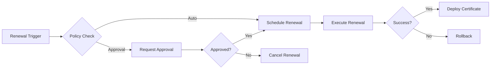

# User Story 08.2 - Automated Certificate Renewal

## User Story
**As a** system administrator  
**I want** intelligent automated certificate renewal  
**So that** certificates are refreshed proactively without manual intervention or service disruption

## INVEST Criteria
- **Independent**: Renewal automation can be developed separately from monitoring
- **Negotiable**: Renewal policies and automation levels are configurable
- **Valuable**: Eliminates manual renewal overhead and prevents service outages
- **Estimable**: 3 sprints for complete automated renewal system
- **Small**: Focused on renewal automation and policies only
- **Testable**: Renewal success/failure scenarios are measurable

## Acceptance Criteria

### Scenario: Policy-Based Renewal Decision Making
```gherkin
Given certificates have different renewal requirements
When determining renewal eligibility
Then evaluate renewal policies:
{
  "renewal_policies": {
    "automatic_renewal_conditions": {
      "certificate_types": ["server", "client", "service"],
      "minimum_days_remaining": 30,
      "maximum_days_remaining": 90,
      "business_hours_only": false,
      "maintenance_window_required": true
    },
    "approval_required_conditions": {
      "high_risk_certificates": ["root_ca", "intermediate_ca"],
      "production_environment": true,
      "extended_validity": "> 2 years",
      "cross_signed_certificates": true
    },
    "blocking_conditions": {
      "certificate_compromised": true,
      "ca_not_available": true,
      "policy_violations": true,
      "pending_security_review": true
    }
  },
  "renewal_strategies": {
    "early_renewal": "Renew 30-60 days before expiration",
    "just_in_time": "Renew 7-14 days before expiration",
    "emergency_renewal": "Renew < 7 days before expiration",
    "proactive_renewal": "Renew based on usage patterns"
  }
}
And implement policy evaluation:
  - Hierarchical policy inheritance
  - Policy conflict resolution
  - Manual policy override capabilities
  - Policy effectiveness tracking
  - Audit trail for policy decisions
```

### Scenario: Intelligent Renewal Scheduling
```gherkin
Given renewals must Minimise service disruption
When scheduling renewal operations
Then implement intelligent scheduling:
  | Scheduling Factor    | Implementation                         |
  | Maintenance windows | Align renewals with scheduled maintenance|
  | Business hours      | Avoid renewals during business-critical hours|
  | System load         | Schedule during low-load periods       |
  | Dependency coordination| Coordinate renewal of dependent certificates|
  | Geographic distribution| Stagger renewals across regions       |
  | Batch Optimisation  | Group related renewals for efficiency  |
And provide scheduling features:
  - Calendar integration for maintenance windows
  - Load-aware scheduling based on system metrics
  - Emergency override for critical renewals
  - Conflict detection and resolution
  - Stakeholder notification of scheduled renewals
```

### Scenario: Pre-Renewal Validation and Testing
```gherkin
Given renewal must not introduce issues
When preparing for renewal
Then perform comprehensive pre-renewal validation:
  | Validation Type      | Validation Steps                       |
  | Certificate authority| Verify CA availability and health      |
  | Policy compliance   | Ensure new certificate meets policies  |
  | Key material        | Validate private key availability and strength|
  | System readiness    | Verify target systems ready for deployment|
  | Dependency check    | Validate dependent certificate status   |
  | Backup verification | Ensure current certificates backed up   |
And implement testing procedures:
  - Staging environment renewal testing
  - Certificate chain validation
  - Compatibility testing with existing systems
  - Performance impact assessment
  - Rollback procedure verification
```

### Scenario: Automated Renewal Execution
```gherkin
Given renewal execution must be reliable and auditable
When executing automatic renewal
Then follow systematic renewal process:
  | Renewal Phase        | Actions                                |
  | Pre-renewal         | Backup current certificates, validate prerequisites|
  | Certificate generation| Generate new certificate with same parameters|
  | Staging deployment  | Deploy to staging environment for testing|
  | Validation testing  | Verify certificate works in staging    |
  | Production deployment| Deploy to production using rolling strategy|
  | Post-deployment     | Verify service health and performance  |
  | Cleanup             | Remove old certificates after validation|
And implement execution safeguards:
  - Atomic renewal operations
  - Rollback triggers for failures
  - Progress tracking and reporting
  - Manual intervention points
  - Emergency abort procedures
```

### Scenario: Renewal Approval Workflows
```gherkin
Given some renewals require human approval
When approval is required
Then implement approval workflows:
  | Approval Type        | Workflow Process                       |
  | Standard approval   | Single approver for routine renewals   |
  | High-risk approval  | Multi-person approval for critical certs|
  | Emergency approval  | Expedited approval with post-review    |
  | Executive approval  | C-level approval for business-critical |
And provide approval features:
  - Mobile-friendly approval interface
  - Approval deadline tracking
  - Automatic escalation for missed approvals
  - Approval rationale documentation
  - Audit trail for all approval decisions
```

### Scenario: Renewal Testing and Validation
```gherkin
Given renewed certificates must function correctly
When validating renewed certificates
Then perform comprehensive testing:
  | Test Category        | Test Implementation                    |
  | Certificate validity | Verify dates, signature, chain        |
  | Service connectivity | Test TLS handshake and authentication  |
  | Application functionality| Verify applications work with new cert|
  | Performance impact  | Measure performance before/after renewal|
  | Security validation | Verify security properties maintained   |
  | Compliance check    | Ensure compliance requirements met     |
And implement validation automation:
  - Automated test suite execution
  - Performance regression detection
  - Security policy validation
  - Functional test automation
  - User acceptance test coordination
```

### Scenario: Renewal Failure Handling and Recovery
```gherkin
Given renewal operations may fail
When renewal failures occur
Then implement comprehensive failure handling:
  | Failure Type         | Recovery Strategy                      |
  | Generation failure  | Retry with backoff, escalate if persistent|
  | Deployment failure  | Automatic rollback to previous certificate|
  | Validation failure  | Hold deployment, alert administrators  |
  | Service disruption  | Emergency rollback, incident response  |
  | Partial failure     | Complete successful nodes, retry failed |
And provide failure recovery:
  - Automatic retry with exponential backoff
  - Rollback to known good state
  - Manual intervention procedures
  - Incident escalation workflows
  - Post-incident analysis and improvement
```

### Scenario: Renewal Coordination and Dependencies
```gherkin
Given certificates may have complex dependencies
When coordinating renewal across dependencies
Then implement dependency management:
  | Dependency Type      | Coordination Strategy                  |
  | Certificate chains  | Renew in proper order (leaf to root)   |
  | Cross-signed certs  | Coordinate with external CAs           |
  | Service clusters    | Rolling renewal to maintain availability|
  | Load balancer certs | Coordinate with traffic management     |
  | Client certificates | Batch renewal to Minimise client impact |
And provide coordination features:
  - Dependency graph visualization
  - Coordinated renewal scheduling
  - Impact analysis for renewal changes
  - Cross-team communication automation
  - Dependency conflict resolution
```

### Scenario: Renewal Analytics and Optimisation
```gherkin
Given renewal processes need continuous improvement
When Analysing renewal performance
Then track comprehensive metrics:
  | Metric Category      | Metrics Tracked                        |
  | Success rates       | Renewal success/failure rates by type  |
  | Performance         | Renewal duration, resource usage       |
  | Business impact     | Service disruption minutes saved       |
  | Cost Optimisation   | Renewal automation ROI                 |
  | Quality metrics     | Defect rates, rollback frequency       |
And provide Optimisation insights:
  - Renewal pattern analysis
  - Failure root cause analysis
  - Process bottleneck identification
  - Cost-benefit analysis
  - Predictive renewal recommendations
```

### Scenario: Emergency and Manual Renewal Procedures
```gherkin
Given emergency situations may require immediate renewal
When emergency renewal is needed
Then support emergency procedures:
  | Emergency Type       | Response Procedure                     |
  | Certificate compromise| Immediate revocation and replacement   |
  | Imminent expiration | Fast-track renewal with minimal validation|
  | Service outage      | Emergency renewal with rollback readiness|
  | Security incident   | Coordinated renewal with security team  |
And provide emergency capabilities:
  - Out-of-band emergency communication
  - Expedited approval processes
  - Emergency contact procedures
  - Simplified renewal workflows
  - Post-emergency review procedures
```

### Scenario: Renewal Integration with CI/CD
```gherkin
Given modern applications use CI/CD for deployment
When integrating renewal with CI/CD pipelines
Then provide seamless integration:
  | Integration Feature  | Implementation                         |
  | Pipeline triggers   | Trigger CI/CD on certificate renewal   |
  | Automated testing   | Include cert validation in pipeline tests|
  | Deployment coordination| Coordinate cert renewal with app deployment|
  | Environment promotion| Promote certificates through environments|
  | Rollback integration| Integrate cert rollback with app rollback|
And support DevOps workflows:
  - GitOps integration for certificate state
  - Infrastructure as code support
  - Automated deployment verification
  - Blue-green deployment coordination
  - Canary deployment support
```

## Edge Cases and Security Considerations

### Edge Case: CA Unavailability During Renewal
```gherkin
Given certificate authorities may be unavailable
When CA is unavailable during renewal
Then:
  - Implement CA failover procedures
  - Queue renewals for retry when CA available
  - Support alternative CA sources
  - Extend certificate validity if possible
  - Alert administrators of CA issues
```

### Edge Case: Renewal During System Maintenance
```gherkin
Given system maintenance may conflict with renewals
When maintenance windows overlap with renewals
Then:
  - Coordinate renewal and maintenance schedules
  - Support renewal postponement
  - Provide maintenance-aware scheduling
  - Enable emergency renewal during maintenance
  - Document maintenance impact on renewals
```

### Edge Case: Mass Renewal Scenarios
```gherkin
Given many certificates may need renewal simultaneously
When handling bulk renewal scenarios
Then:
  - Implement bulk renewal capabilities
  - Provide resource throttling
  - Support staged renewal rollouts
  - Monitor system performance during bulk operations
  - Enable emergency abort for bulk renewals
```

### Edge Case: Network Partitions and Split-Brain
```gherkin
Given distributed systems may experience network partitions
When network partitions occur during renewal
Then:
  - Implement consensus protocols for renewal decisions
  - Support partial renewal completion
  - Provide network partition detection
  - Enable manual resolution of split-brain scenarios
  - Maintain renewal state consistency
```

## Security Hardening

```gherkin
Given automated renewal involves sensitive operations
Then implement comprehensive security:
  | Security Control     | Implementation                         |
  | Renewal Authorisation| Strong authentication for renewal operations|
  | Audit logging       | Complete audit trail of all renewals   |
  | Secure key handling | Protect private keys during renewal     |
  | Access controls     | Role-based access to renewal functions |
  | Non-repudiation     | Cryptographic proof of renewal actions  |
  | Integrity protection| Verify renewal artifacts integrity     |
  | Secure communication| TLS encryption for all renewal operations|
  | Incident response   | Security incident procedures for renewals|
```

## Performance Requirements

```gherkin
Given renewal automation must be efficient and scalable
Then meet these targets:
  | Performance Metric   | Target                                 |
  | Renewal processing  | < 5 minutes per certificate renewal     |
  | Bulk renewal        | 100+ certificates per hour             |
  | System availability | 99.9% availability during renewals     |
  | Resource efficiency | < 10% CPU/memory during renewal ops    |
  | Network efficiency  | < 100MB data transfer per renewal      |
  | Storage efficiency  | < 50MB storage per renewal operation    |
```

## Integration Examples

### Renewal Policy Configuration
```yaml
renewal_policies:
  - name: "production_servers"
    conditions:
      certificate_type: "server"
      environment: "production"
    rules:
      automatic_renewal: true
      renewal_window: "30-60_days"
      maintenance_window_required: true
      approval_required: false
    
  - name: "ca_certificates"
    conditions:
      certificate_type: "ca"
    rules:
      automatic_renewal: false
      approval_required: true
      approvers: ["security_team", "ca_manager"]
```

### Renewal Workflow


## Technical Notes
- Implement idempotent renewal operations
- Use distributed locking for concurrent renewal prevention
- Implement state machines for renewal workflow
- Use database transactions for renewal state consistency
- Plan for horizontal scaling of renewal services
- Implement circuit breakers for external dependencies
- Use message queues for reliable renewal processing
- Support both synchronous and asynchronous renewal

## Definition of Done
- [ ] Policy-based renewal decision making
- [ ] Intelligent renewal scheduling
- [ ] Pre-renewal validation and testing
- [ ] Automated renewal execution
- [ ] Renewal approval workflows
- [ ] Renewal testing and validation
- [ ] Failure handling and recovery
- [ ] Renewal coordination and dependencies
- [ ] Renewal analytics and Optimisation
- [ ] Emergency and manual procedures
- [ ] CI/CD integration support
- [ ] Edge cases handled
- [ ] Security hardening applied
- [ ] Performance targets met
- [ ] Comprehensive testing complete
- [ ] Documentation comprehensive