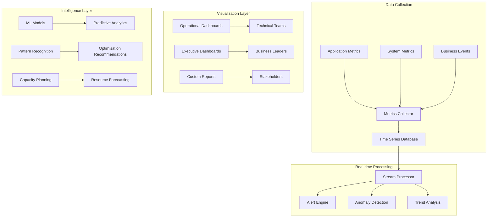

# Phase 2 Epic 09: Enhanced Monitoring and Observability

## Overview
Comprehensive monitoring and observability provide visibility into certificate infrastructure health, performance, and business impact. This epic implements advanced dashboards, metrics collection, and business intelligence capabilities to support operational excellence and strategic decision making.

## User Stories
1. **09.1 - Operational Dashboards**: Real-time operational monitoring with actionable insights
2. **09.2 - Business Intelligence Metrics**: Executive-level analytics and business impact measurement

## Dependencies
- A5 (Operational Foundation) - Basic health and metrics infrastructure
- Epic 6 (SCB Management) - Bundle usage metrics
- Epic 7 (Deployment) - Deployment success metrics
- Epic 8 (Lifecycle) - Certificate lifecycle metrics

## Success Metrics
- 100% infrastructure visibility
- < 2 second dashboard response time
- 99.9% metrics collection reliability
- Real-time alerting (< 1 minute)
- Executive dashboard adoption > 80%
- Actionable insights delivery monthly

## Technical Considerations
- Prometheus/Grafana integration
- Real-time metrics streaming
- Multi-dimensional metric analysis
- Custom business metrics definition
- Integration with existing monitoring
- Performance impact minimization
- Historical data retention
- Cross-platform compatibility

## Workflow Diagram

