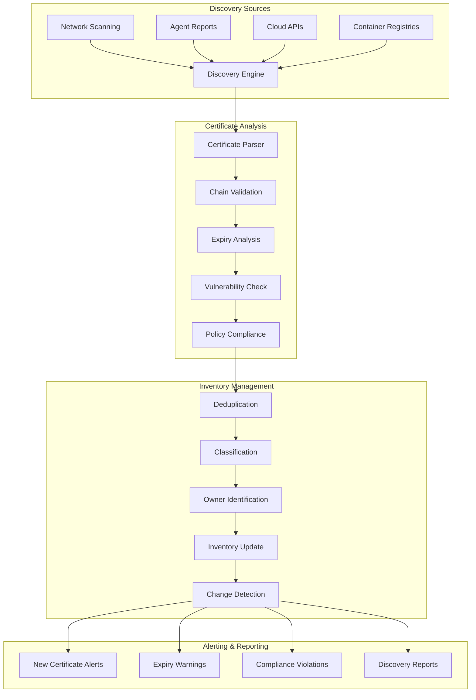

# Phase 3 Epic 12: Certificate Discovery and Validation

## Overview
Certificate discovery and validation ensure comprehensive visibility into the certificate landscape across the enterprise. This epic implements automated network scanning, certificate inventory discovery, validation checks, and shadow certificate detection to maintain complete certificate lifecycle visibility.

## User Stories
1. **12.1 - Network Certificate Scanning**: Automated discovery of certificates across network infrastructure

## Dependencies
- A1 (API Framework) - Base API infrastructure
- A4 (Security Fundamentals) - Security scanning permissions
- Epic 4 (Certificate Storage) - Discovered certificate storage
- Epic 9 (Monitoring) - Integration with monitoring dashboards

## Success Metrics
- 99%+ certificate discovery rate
- < 5 minutes for network segment scan
- Zero false positive rate for certificate identification
- 100% validation of discovered certificates
- < 24 hours for full enterprise scan
- Real-time discovery of new certificates

## Technical Considerations
- Agentless scanning for minimal impact
- Multi-protocol support (HTTPS, LDAPS, SMTPS, etc.)
- Parallel scanning for performance
- Certificate chain validation
- Vulnerability assessment integration
- Shadow certificate detection
- Integration with CMDB/asset management
- Support for cloud and container environments

## Workflow Diagram

