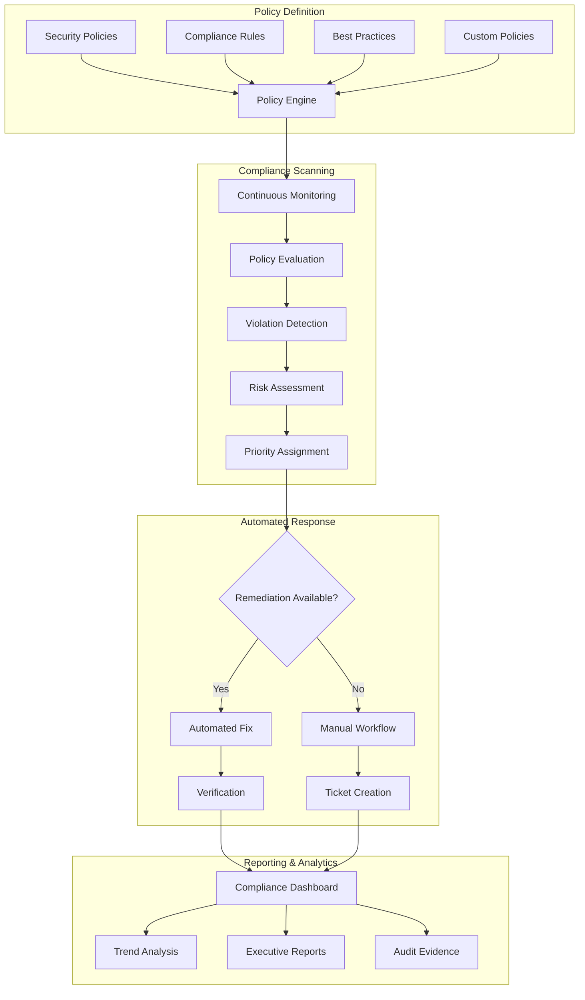

# Phase 3 Epic 13: Automated Compliance Validation

## Overview
Automated compliance validation ensures continuous adherence to security policies and regulatory requirements. This epic implements real-time policy compliance scanning, automated remediation workflows, and proactive compliance monitoring to maintain security posture and regulatory alignment.

## User Stories
1. **13.1 - Policy Compliance Scanning**: Automated scanning and validation against security policies

## Dependencies
- A4 (Security Fundamentals) - Base security policies
- Epic 11 (Audit & Compliance) - Compliance framework integration
- Epic 12 (Certificate Discovery) - Certificate inventory for scanning

## Success Metrics
- 100% policy coverage for scanning
- < 5 minutes for compliance assessment
- 95%+ automated remediation success rate
- Zero false positive compliance violations
- < 1 hour mean time to remediation
- Real-time compliance status visibility

## Technical Considerations
- Policy as code implementation
- Real-time compliance monitoring
- Automated remediation workflows
- Risk-based prioritization
- Multi-framework policy support
- Continuous compliance validation
- Integration with GRC platforms
- Machine learning for anomaly detection

## Workflow Diagram

