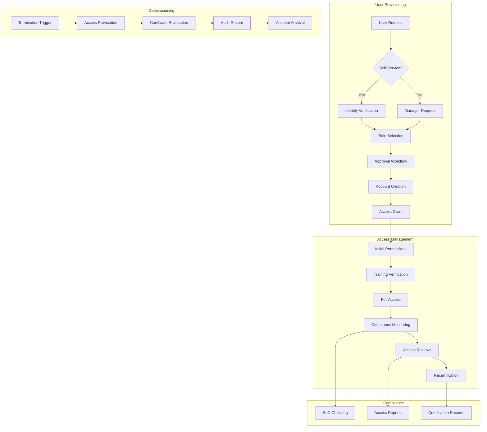

# Phase 3 Epic 14: User Access Automation

## Overview
User access automation streamlines the provisioning and management of user accounts and permissions within the certificate management system. This epic implements automated user provisioning, role assignment, access reviews, and deprovisioning workflows to ensure secure and efficient user lifecycle management.

## User Stories
1. **14.1 - Automated User Provisioning**: Self-service user onboarding with automated approval workflows

## Dependencies
- A2 (Authentication & Authorization) - Base user management system
- A3 (LDAP Integration) - Directory service integration
- Epic 11 (Audit & Compliance) - User access audit trails

## Success Metrics
- < 5 minutes user provisioning time
- 100% automated provisioning for standard roles
- Zero unauthorized access after deprovisioning
- 99%+ accuracy in role assignments
- < 24 hours for access reviews
- Complete audit trail for all access changes

## Technical Considerations
- Identity provider integration (LDAP, SAML, OIDC)
- Automated approval workflows
- Role mining and optimization
- Access certification campaigns
- Just-in-time access provisioning
- Segregation of duties enforcement
- Orphaned account detection
- Integration with HR systems

## Workflow Diagram

