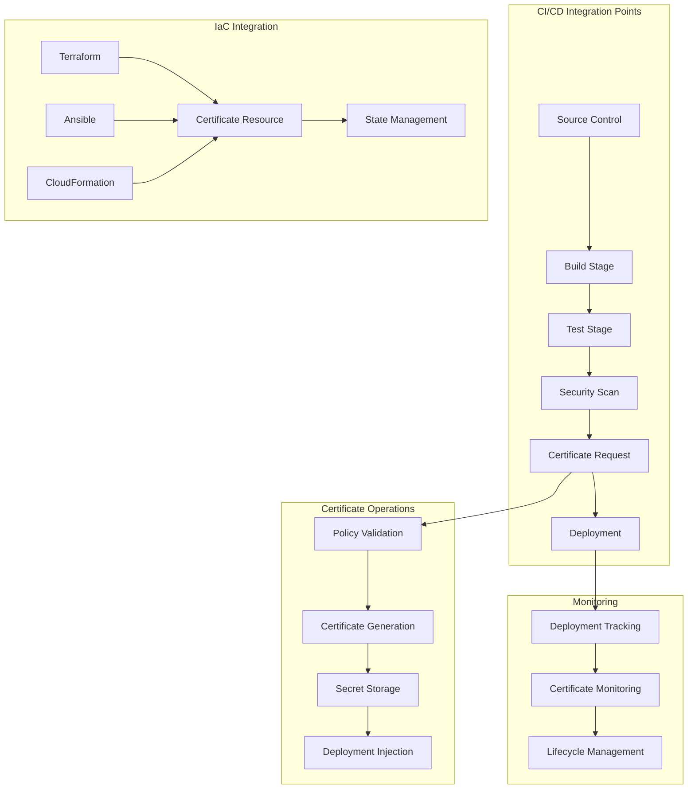

# Phase 3 Epic 15: Advanced Integration Capabilities

## Overview
Advanced integration capabilities enable seamless incorporation of certificate management into modern DevOps workflows and CI/CD pipelines. This epic implements native integrations with popular CI/CD platforms, infrastructure as code tools, and automation frameworks to make certificate operations a natural part of the development and deployment lifecycle.

## User Stories
1. **15.1 - CI/CD Pipeline Integration**: Native integration with CI/CD platforms for automated certificate operations

## Dependencies
- A1 (API Framework) - REST API for integrations
- Epic 2 (Certificate Generation) - Core certificate operations
- Epic 7 (Automated Deployment) - Deployment capabilities
- Epic 11 (Audit & Compliance) - Integration audit trails

## Success Metrics
- 15+ CI/CD platform integrations
- < 2 minutes certificate generation in pipelines
- 100% automation capability for certificate operations
- Zero manual intervention for standard workflows
- 99.9% pipeline success rate
- Real-time certificate provisioning

## Technical Considerations
- Native plugins for major CI/CD platforms
- Infrastructure as Code (IaC) support
- GitOps workflow integration
- Secret management integration
- Container and Kubernetes native
- Declarative certificate definitions
- Pipeline security scanning
- Multi-cloud deployment support

## Workflow Diagram

