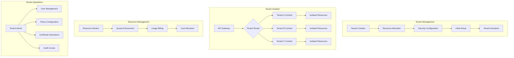

# Phase 4 Epic 16: Multi-Tenancy Support

## Overview
Multi-tenancy support enables a single instance of the Cassandra Security Manager to serve multiple Organisations or business units with complete isolation and customization. This epic implements comprehensive tenant isolation, resource management, and per-tenant customization while maintaining security and performance.

## User Stories
1. **16.1 - Tenant Isolation**: Complete isolation of tenant data, operations, and configurations

## Dependencies
- A2 (Authentication & Authorisation) - Base access control system
- A3 (Data Persistence) - Multi-tenant data architecture
- Epic 10 (Audit & Compliance) - Per-tenant audit trails
- Epic 13 (User Access) - Tenant-aware user management

## Success Metrics
- 100% data isolation between tenants
- < 5% performance overhead for multi-tenancy
- Zero cross-tenant security incidents
- 99.9% tenant availability SLA
- < 5 minutes tenant provisioning time
- Unlimited horizontal tenant scaling

## Technical Considerations
- Database-level tenant isolation
- Per-tenant encryption keys
- Resource quota management
- Tenant-specific customization
- Cross-tenant analytics (with privacy)
- Tenant migration capabilities
- Disaster recovery per tenant
- Compliance boundary enforcement

## Workflow Diagram

