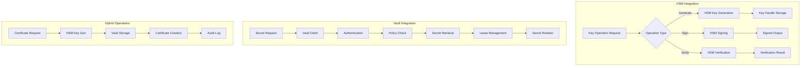

# Phase 4 Epic 17: External Security Infrastructure Integration

## Overview
External security infrastructure integration enables the Cassandra Security Manager to leverage enterprise-grade hardware security modules (HSMs) and secret management platforms. This epic implements seamless integration with HSMs for cryptographic operations and HashiCorp Vault for Centralised secret management, providing enhanced security and compliance capabilities.

## User Stories
1. **17.1 - Hardware Security Module Integration**: FIPS 140-2 Level 3 HSM support for key operations
2. **17.2 - HashiCorp Vault Integration**: Centralised secret management and dynamic credentials

## Dependencies
- A4 (Security Fundamentals) - Base security architecture
- Epic 1 (CA Hierarchy) - Certificate authority operations
- Epic 2 (Certificate Generation) - Key generation workflows
- Epic 4 (Certificate Storage) - Secret storage abstraction

## Success Metrics
- 100% HSM-based key generation for critical CAs
- < 100ms HSM operation latency
- Zero key material exposure outside HSM
- 99.99% HSM availability
- < 5 seconds Vault secret retrieval
- Complete audit trail for all operations

## Technical Considerations
- HSM vendor compatibility (Thales, Entrust, AWS CloudHSM)
- Network-attached vs. embedded HSMs
- HSM clustering and load balancing
- Key ceremony procedures
- Vault namespace isolation
- Dynamic secret rotation
- Performance Optimisation
- Disaster recovery with HSM backup

## Workflow Diagram

