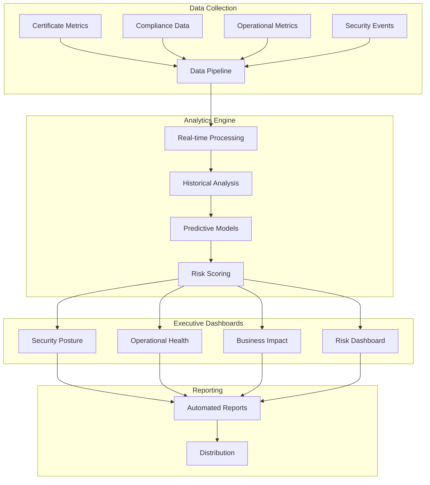

# Phase 4 Epic 18: Advanced Reporting and Analytics

## Overview
Advanced reporting and analytics provide executive-level visibility into the certificate infrastructure's security posture, operational health, and business impact. This epic implements sophisticated dashboards, predictive analytics, and strategic insights that enable data-driven decision making for security leadership and business executives.

## User Stories
1. **18.1 - Executive Security Dashboards**: Real-time executive dashboards with KPIs and risk metrics

## Dependencies
- Epic 9 (Monitoring & Observability) - Base metrics infrastructure
- Epic 10 (Audit & Compliance) - Compliance data sources
- Epic 11 (Certificate Discovery) - Complete certificate inventory
- Epic 12 (Compliance Validation) - Policy compliance metrics

## Success Metrics
- < 2 second dashboard load time
- 100% real-time data accuracy
- 15+ executive KPIs tracked
- 95% prediction accuracy for certificate issues
- < 5 minutes report generation
- Mobile-responsive dashboard access

## Technical Considerations
- Real-time data aggregation
- Advanced visualization libraries
- Machine learning for predictions
- Multi-dimensional analytics
- Executive report automation
- Mobile and tablet optimization
- Export capabilities (PDF, PPT)
- Role-based dashboard access

## Workflow Diagram

