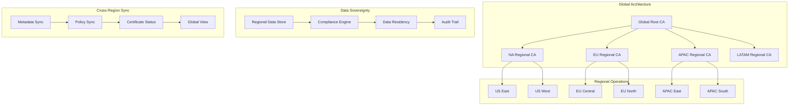

# Phase 4 Epic 19: Geographic Distribution and Compliance

## Overview
Geographic distribution and compliance enable global Organisations to deploy certificate infrastructure across multiple regions while maintaining data sovereignty, regulatory compliance, and optimal performance. This epic implements regional CA deployment, cross-region Synchronisation, and location-aware certificate management to meet diverse geographic and regulatory requirements.

## User Stories
1. **19.1 - Regional CA Deployment**: Deploy and manage certificate authorities across geographic regions

## Dependencies
- Epic 1 (CA Hierarchy) - Base CA infrastructure
- Epic 16 (Multi-Tenancy) - Tenant isolation per region
- Epic 10 (Audit & Compliance) - Regional compliance requirements
- Epic 20 (High Availability) - Cross-region failover capabilities

## Success Metrics
- < 50ms regional certificate operations
- 100% data sovereignty compliance
- 99.9% regional availability
- Zero cross-region data violations
- < 5 minutes cross-region sync
- Support for 20+ geographic regions

## Technical Considerations
- Data residency requirements
- Regional compliance variations
- Network latency Optimisation
- Cross-region replication
- Regional failover strategies
- Multi-language support
- Time zone handling
- Regional PKI hierarchies

## Workflow Diagram

