# Phase 5 Epic 20: High Availability and Disaster Recovery

## Overview
High availability and disaster recovery ensure the certificate management system maintains continuous operations even during failures, disasters, or maintenance. This epic implements active-active deployment patterns, automated failover mechanisms, and comprehensive disaster recovery procedures to achieve 99.99% availability and minimal data loss.

## User Stories
1. **20.1 - Active-Active Deployment**: Multi-region active-active architecture with automatic failover

## Dependencies
- Epic 16 (Multi-Tenancy) - Tenant-aware HA
- Epic 17 (Security Infrastructure) - HSM and Vault HA
- Epic 19 (Geographic Distribution) - Regional deployment foundation
- All previous epics for comprehensive HA coverage

## Success Metrics
- 99.99% availability (52.56 minutes downtime/year)
- < 30 seconds automatic failover time
- Zero data loss (RPO = 0)
- < 5 minutes recovery time (RTO)
- 100% successful DR drills
- No single points of failure

## Technical Considerations
- Active-active architecture patterns
- Consensus algorithms (Raft, Paxos)
- Multi-region data replication
- Split-brain prevention
- Automated health checks
- Self-healing capabilities
- Chaos engineering testing
- Zero-downtime upgrades

## Workflow Diagram

```mermaid
graph TB
    subgraph "Active-Active Architecture"
        A[Region A Active] <--> B[Region B Active]
        A <--> C[Region C Active]
        B <--> C
        
        A --> D[Load Balancer A]
        B --> E[Load Balancer B]
        C --> F[Load Balancer C]
    end
    
    subgraph "Data Replication"
        G[Primary Database] --> H[Sync Replication]
        H --> I[Secondary Database]
        H --> J[Tertiary Database]
        
        K[Consensus Protocol] --> G
        K --> I
        K --> J
    end
    
    subgraph "Failure Detection"
        L[Health Monitors] --> M[Failure Detection]
        M --> N[Automatic Failover]
        N --> O[Traffic Rerouting]
        O --> P[State Recovery]
    end
    
    subgraph "Disaster Recovery"
        Q[Continuous Backup] --> R[Point-in-Time Recovery]
        R --> S[DR Site Activation]
        S --> T[Data Restoration]
        T --> U[Service Validation]
    end
```

