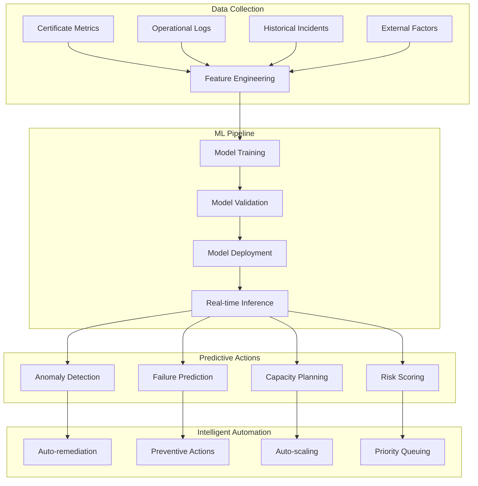

# Phase 5 Epic 21: Advanced Automation and Intelligence

## Overview
Advanced automation and intelligence transform certificate management from reactive to predictive operations. This epic implements machine learning models for predictive analytics, intelligent automation for self-healing systems, and advanced algorithms that anticipate and prevent certificate-related issues before they impact business operations.

## User Stories
1. **21.1 - Predictive Certificate Management**: ML-powered predictive analytics and automated remediation

## Dependencies
- Epic 8 (Lifecycle Management) - Historical data for predictions
- Epic 9 (Monitoring) - Metrics for ML training
- Epic 11 (Discovery) - Complete certificate inventory
- Epic 18 (Analytics) - Analytics infrastructure

## Success Metrics
- 95% prediction accuracy for certificate issues
- 90% reduction in certificate-related incidents
- < 1 hour mean time to predict issues
- 99% automated remediation success rate
- 80% reduction in manual operations
- Zero unexpected certificate expirations

## Technical Considerations
- Machine learning model selection
- Real-time model inference
- Feature engineering pipeline
- Model retraining automation
- Explainable AI requirements
- Edge computing for predictions
- Federated learning for privacy
- AutoML for model optimization

## Workflow Diagram

